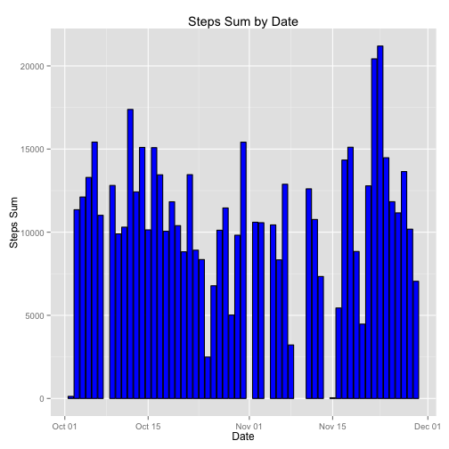
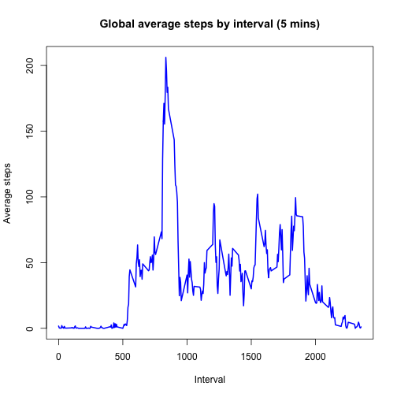
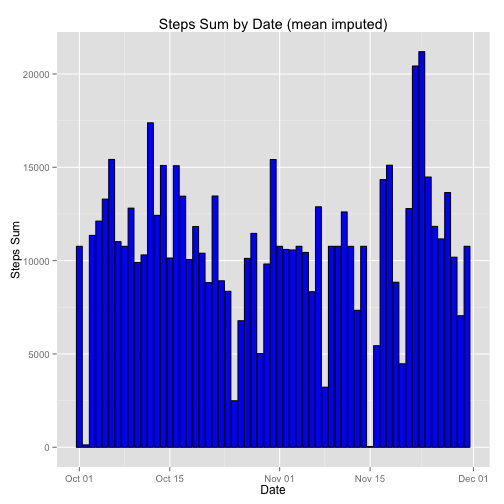
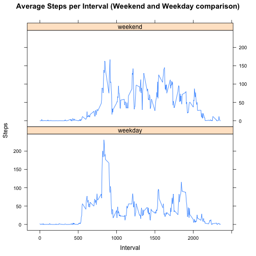

First loading needed libraries


```r
library(data.table)
library(ggplot2)
library(lattice)
library(knitr)
```

## Loading and preprocessing the data

Now loading data, and converting date field to Date


```r
if (!file.exists('./activity.csv')) {
  unzip('activity.zip', exdir='.')
}
data <- read.csv('activity.csv')
data$date <- as.Date(data$date, '%Y-%m-%d')
summary(data)
```

```
##      steps             date               interval     
##  Min.   :  0.00   Min.   :2012-10-01   Min.   :   0.0  
##  1st Qu.:  0.00   1st Qu.:2012-10-16   1st Qu.: 588.8  
##  Median :  0.00   Median :2012-10-31   Median :1177.5  
##  Mean   : 37.38   Mean   :2012-10-31   Mean   :1177.5  
##  3rd Qu.: 12.00   3rd Qu.:2012-11-15   3rd Qu.:1766.2  
##  Max.   :806.00   Max.   :2012-11-30   Max.   :2355.0  
##  NA's   :2304
```

## What is mean total number of steps taken per day?

For now, we'll ignore NA row  
Then, preapring data for graphing steps sum by date


```r
cleanData <- data[complete.cases(data),]
summary(cleanData)
```

```
##      steps             date               interval     
##  Min.   :  0.00   Min.   :2012-10-02   Min.   :   0.0  
##  1st Qu.:  0.00   1st Qu.:2012-10-16   1st Qu.: 588.8  
##  Median :  0.00   Median :2012-10-29   Median :1177.5  
##  Mean   : 37.38   Mean   :2012-10-30   Mean   :1177.5  
##  3rd Qu.: 12.00   3rd Qu.:2012-11-16   3rd Qu.:1766.2  
##  Max.   :806.00   Max.   :2012-11-29   Max.   :2355.0
```

```r
cleanDataDT <- data.table(cleanData)
stepsByDayDT <- cleanDataDT[, sum(steps), by = date]
setnames(stepsByDayDT,"V1","stepSum")
summary(stepsByDayDT)
```

```
##       date               stepSum     
##  Min.   :2012-10-02   Min.   :   41  
##  1st Qu.:2012-10-16   1st Qu.: 8841  
##  Median :2012-10-29   Median :10765  
##  Mean   :2012-10-30   Mean   :10766  
##  3rd Qu.:2012-11-16   3rd Qu.:13294  
##  Max.   :2012-11-29   Max.   :21194
```

Graphing 

```r
p <- ggplot(data=stepsByDayDT, aes(x=date, y=stepSum)) + geom_histogram(stat='identity', colour="black", fill='blue') + ggtitle('Steps Sum by Date') + xlab('Date') + ylab('Steps Sum')
print(p)
```

 

Next step is to see how Steps sum mean and median looks like 


```r
mean(stepsByDayDT$stepSum)
```

```
## [1] 10766.19
```


```r
median(stepsByDayDT$stepSum)
```

```
## [1] 10765
```

## What is the average daily activity pattern?

Looking at Daily mean steps activity, by measure interval 

- Preparing data
- Having a look at data
- Plotting 


```r
dataDT <- data.table(cleanData)
head(dataDT)
```

```
##    steps       date interval
## 1:     0 2012-10-02        0
## 2:     0 2012-10-02        5
## 3:     0 2012-10-02       10
## 4:     0 2012-10-02       15
## 5:     0 2012-10-02       20
## 6:     0 2012-10-02       25
```

```r
intervalDT <- dataDT[, mean(steps), by = interval]
setnames(intervalDT,"V1","stepAvg")
summary(intervalDT)
```

```
##     interval         stepAvg       
##  Min.   :   0.0   Min.   :  0.000  
##  1st Qu.: 588.8   1st Qu.:  2.486  
##  Median :1177.5   Median : 34.113  
##  Mean   :1177.5   Mean   : 37.383  
##  3rd Qu.:1766.2   3rd Qu.: 52.835  
##  Max.   :2355.0   Max.   :206.170
```

```r
plot(intervalDT$interval, intervalDT$stepAvg, type="l", main='Global average steps by interval (5 mins)', xlab= "Interval", ylab= "Average steps", col="blue" , lwd=2)
```

 

What is the interval having max average steps activity


```r
#intervalDT$interval[which.max(intervalDT$stepAvg)]
sorted <- intervalDT[order(-stepAvg)]
sorted[1,]
```

```
##    interval  stepAvg
## 1:      835 206.1698
```

## Imputing missing values

Checking missing values  

Overall check

```r
sum(is.na(data))
```

```
## [1] 2304
```

Column by column check

```r
colSums(is.na(data))
```

```
##    steps     date interval 
##     2304        0        0
```

Preparing data

```r
intervalDT <- dataDT[, mean(steps), by = interval]
setnames(intervalDT,"V1","stepAvg")
```

Setting up strategy for **Imputing** missing values  
Decision is to get overall average intervals for the step through dataset

```r
df <- data
for (i in 1:nrow(df)) {
    if (is.na(df$steps[i])) {
        df$steps[i] <- intervalDT[which(df$interval[i] == intervalDT$interval), ]$stepAvg
    }
}
head(df)
```

```
##       steps       date interval
## 1 1.7169811 2012-10-01        0
## 2 0.3396226 2012-10-01        5
## 3 0.1320755 2012-10-01       10
## 4 0.1509434 2012-10-01       15
## 5 0.0754717 2012-10-01       20
## 6 2.0943396 2012-10-01       25
```

Imputing missing data

```r
dfDT <- data.table(df)
imputedData <- dfDT[, sum(steps), by = date]
setnames(imputedData,"V1","stepSum")
p <- ggplot(data=imputedData, aes(x=date, y=stepSum)) + geom_histogram(stat='identity', colour="black", fill='blue')+ ggtitle('Steps Sum by Date (mean imputed)') + xlab('Date') + ylab('Steps Sum')
print(p)
```

 
No real difference once data imputed, which makes sense as long as we imputed mean value

Checking for mean steps once missing data imputed

```r
mean(imputedData$stepSum)
```

```
## [1] 10766.19
```
Doesn't seem to change data 

Checking for median steps once missing data imputed

```r
median(imputedData$stepSum)
```

```
## [1] 10766.19
```
Doesn't seem to change data 

## Are there differences in activity patterns between weekdays and weekends?

Preparing data for Week days vs Weekend days activity comparison

- Adding new column
- Transforming this new column to Factor

```r
Sys.setlocale("LC_TIME","en_US")
```

```
## [1] "en_US"
```

```r
dfDT$dayType <- ifelse(weekdays(dfDT$date) %in% c('Saturday', 'Sunday'), 'weekend', 'weekday')
dfDT$dayType <- as.factor(dfDT$dayType)
summary(dfDT$dayType)
```

```
## weekday weekend 
##   12960    4608
```

Graphing results

```r
stepsByDayType <- aggregate(steps ~ interval + dayType, dfDT, mean)
p<-xyplot(stepsByDayType$steps ~ stepsByDayType$interval|stepsByDayType$dayType, main="Average Steps per Interval (Weekend and Weekday comparison)",xlab="Interval", ylab="Steps",layout=c(1,2), type="l")
print(p)
```

 

Obviously weekend vs week days activity is quite different

knit2html('PA1_template.Rmd')
